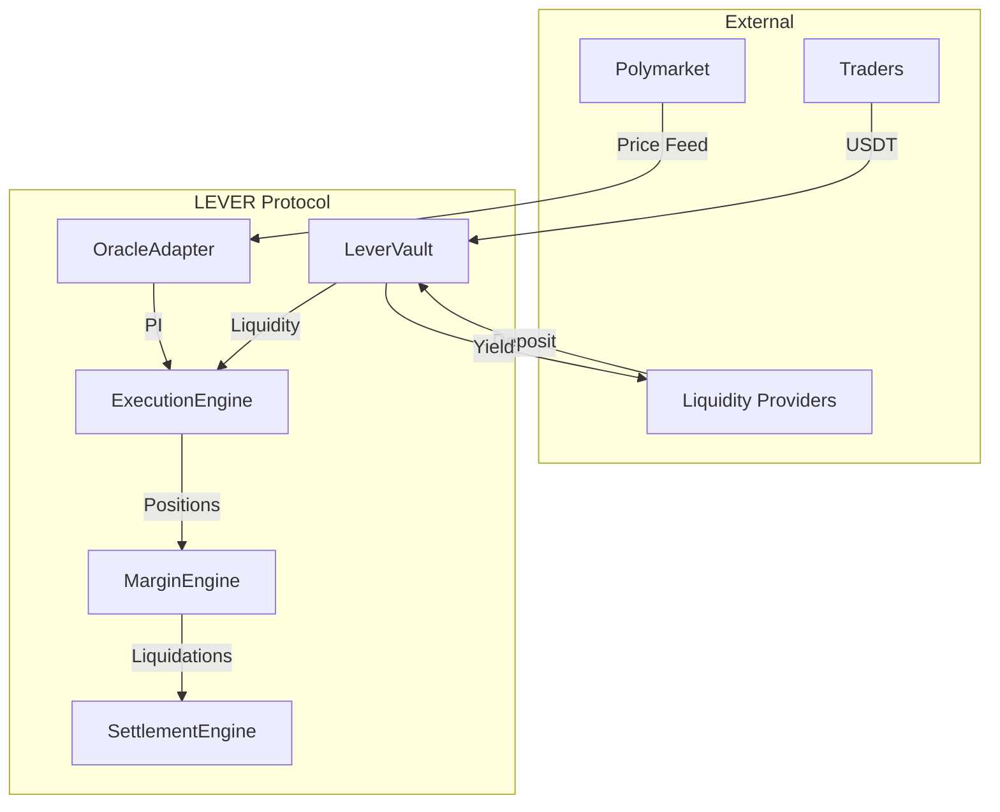

# LEVER Protocol
### Synthetic Leveraged Perpetuals for Prediction Markets

LEVER transforms prediction markets from binary yes/no betting into sophisticated leveraged trading instruments. Traders take 2-50x leveraged positions on probability movements across elections, sports, economics, and emerging events, while liquidity providers earn yield from a unified vault backing all markets simultaneously.

## The Opportunity

Prediction markets represent one of the fastest-growing segments in decentralized finance, with **$13 billion monthly spot volume** and virtually no leverage infrastructure. While traditional derivatives markets offer 20-100x leverage on every asset class, prediction market traders are limited to 1x spot exposure—despite representing **$65-130 billion in addressable market opportunity**.

## The Solution

LEVER introduces **synthetic leveraged perpetuals** on binary outcomes without creating new price discovery mechanisms. The protocol:

- **References external oracle prices** from established prediction markets (Polymarket, Kalshi)
- **Scales exposure** through synthetic positions rather than spot market manipulation
- **Unifies liquidity** across all markets through a single ERC-4626 vault
- **Manages risk** via continuous time-to-expiration curves and borrow fee escalation

### Live Markets

LEVER supports diverse event categories with real-time Polymarket integration:

**Technology:** SpaceX IPO timing, OpenSea token launch
**Geopolitics:** US-Iran ceasefire negotiations, election outcomes
**Economics:** Federal Reserve rate decisions, currency movements
**Sports:** FIFA World Cup winner predictions
**Finance:** Apple stock price targets, IPO market timing

## How It Works

### For Traders
1. **Deposit USDT** as collateral to the AccountManager
2. **Open leveraged positions** (2-50x) on any supported binary outcome
3. **Profit from probability movements** — not just binary resolution
4. **Pay borrow fees** that scale with leverage and time-to-expiration
5. **Face liquidation** if equity falls below maintenance margin

**Example:** Open 10x long on "Fed Rate Below 4%" at 55% probability. If probability rises to 65%, earn ~180% ROI before fees.

### For Liquidity Providers
1. **Deposit USDT** into LeverVault, receive lvUSDT shares (ERC-4626)
2. **Earn yield** from trader borrow fees (2-50 bps/hour base rate)
3. **Absorb trader PnL** — profit when traders lose, pay when traders win
4. **Access real-time yields** via RewardsDistributor without burning shares
5. **Withdraw** via 48-hour queue with utilization-based gates

**Yield Sources:** Borrow fees (50%), trading fees (50%), funding payments (100% of unmatched flow)

## Architecture

### Core Infrastructure
- **OracleAdapter** — Polymarket price ingestion with smoothing and validation
- **MarketRegistry** — Market metadata, time-to-expiration calculation
- **AccountManager** — Trader USDT deposits, collateral management
- **PositionManager** — Position state storage (entry price, size, leverage)

### Risk & Execution
- **ExecutionEngine** — Trade orchestration, imbalance-adjusted pricing
- **MarginEngine** — Initial/maintenance margin, equity calculation
- **LeverageModel** — Dynamic leverage caps based on time-to-expiration
- **OILimits** — Global, per-market, per-side, per-user open interest caps

### Vault & Settlement
- **LeverVault** — Unified ERC-4626 LP vault with tranche ledger system
- **RewardsDistributor** — Yield distribution without share dilution
- **LiquidationEngine** — Automated position liquidation at maintenance margin
- **SettlementEngine** — Binary resolution, payout calculation, bad debt handling

### Fee Infrastructure
- **BorrowFeeEngine** — Time-weighted fees scaling with leverage and market stress
- **FundingRateEngine** — Trader-to-trader payments for OI imbalances
- **FeeRouter** — Deterministic fee split (50% LP, 30% Protocol, 20% Insurance)
- **InsuranceFund** — Bad debt absorption with tiered protection mechanisms

## Technical Stack

**Blockchain:** Base (production), Base Sepolia (testnet)
**Solidity:** 0.8.24 with 200-run optimization
**Framework:** Foundry for development, testing, deployment
**Dependencies:** OpenZeppelin v5.6.1, Solmate
**Oracle:** Real-time Polymarket CLOB integration
**Testing:** 1,000+ test functions across unit and integration suites

## Risk Management

### Time-Based Risk Curves
- **Leverage compression** as markets approach expiration
- **Borrow fee escalation** forces 1x collateralization at resolution
- **Dynamic parameter adjustment** based on time-to-expiration

### Multi-Tier Protection
- **Initial margin** prevents overleveraged entries
- **Maintenance margin** triggers liquidations before losses exceed collateral
- **Insurance fund** absorbs bad debt with daily limits and IFR floors
- **Withdrawal gates** at 80% vault utilization

### Oracle Security
- **Multi-source validation** across Polymarket REST, WebSocket, and backup feeds
- **Price smoothing** via exponential moving averages
- **Anti-manipulation filters** on spread, depth, and volatility

## Security & Auditing

- **1,016 passing tests** across comprehensive unit and integration suites
- **Mathematical verification** against protocol whitepaper formulas
- **Continuous integration** with automated regression detection
- **Professional security audit** scheduled pre-mainnet

## Development Team

Built by experienced DeFi protocol engineers with expertise in derivatives, risk management, and prediction market mechanics. Active development with transparent progress tracking and comprehensive documentation.

## Links

**Documentation:** [Technical Specs](./CLAUDE.md) | [Architecture](./KNOWLEDGE/ARCHITECTURE.md)
**Code:** [GitHub Repository](https://github.com/lever-protocol) | [Test Suite](./test/)
**Oracle Infrastructure:** [Price Feeds](./scripts/oracle/) | [Market Discovery](./scripts/oracle/market_discovery.py)

---

*LEVER Protocol — Bringing institutional-grade leverage to prediction markets*