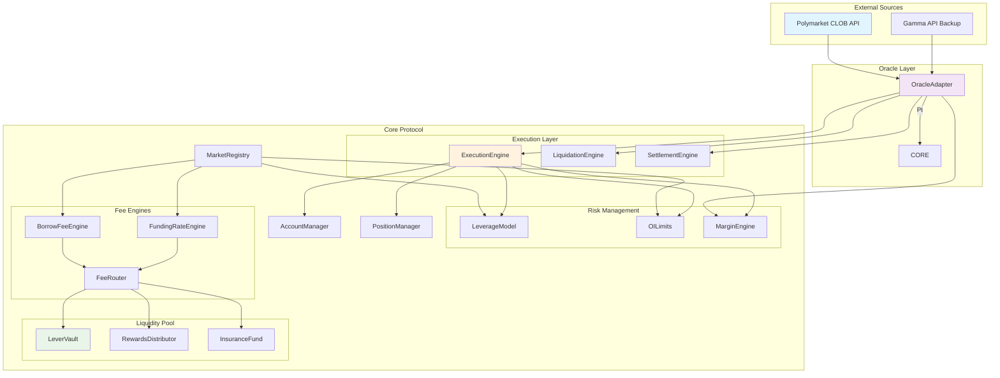
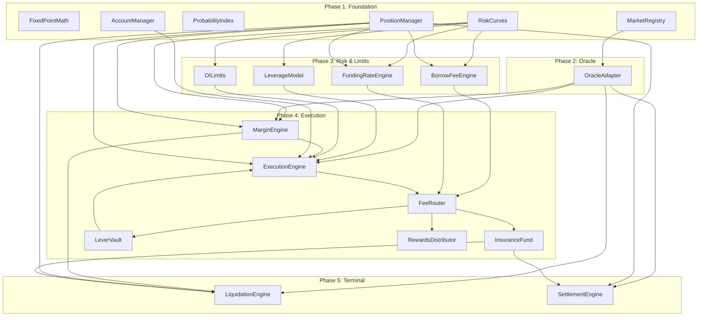
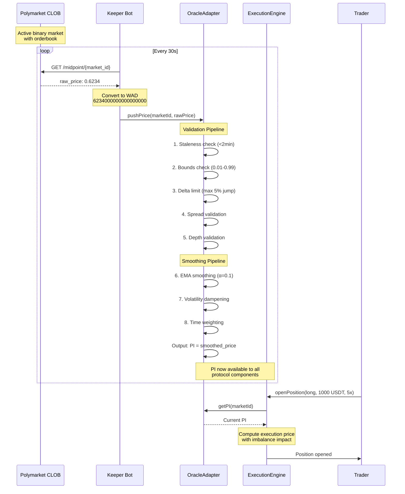
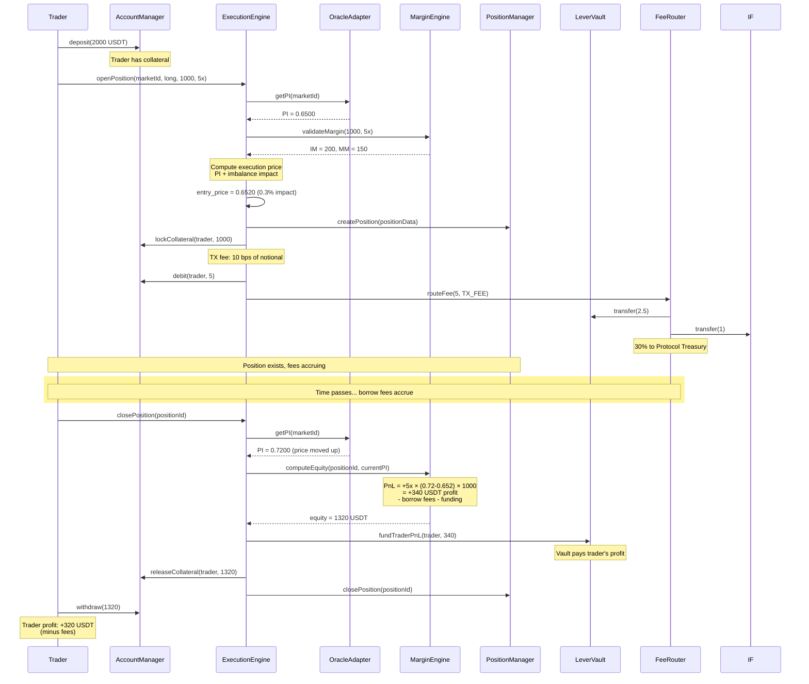
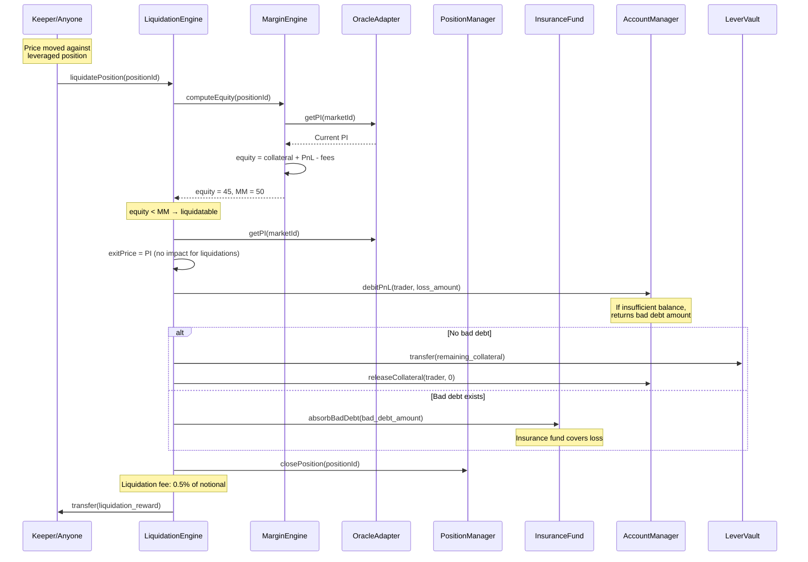
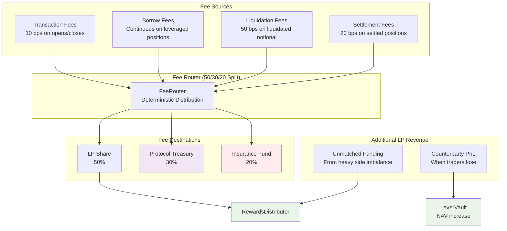
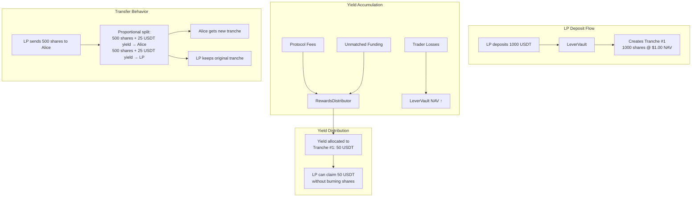
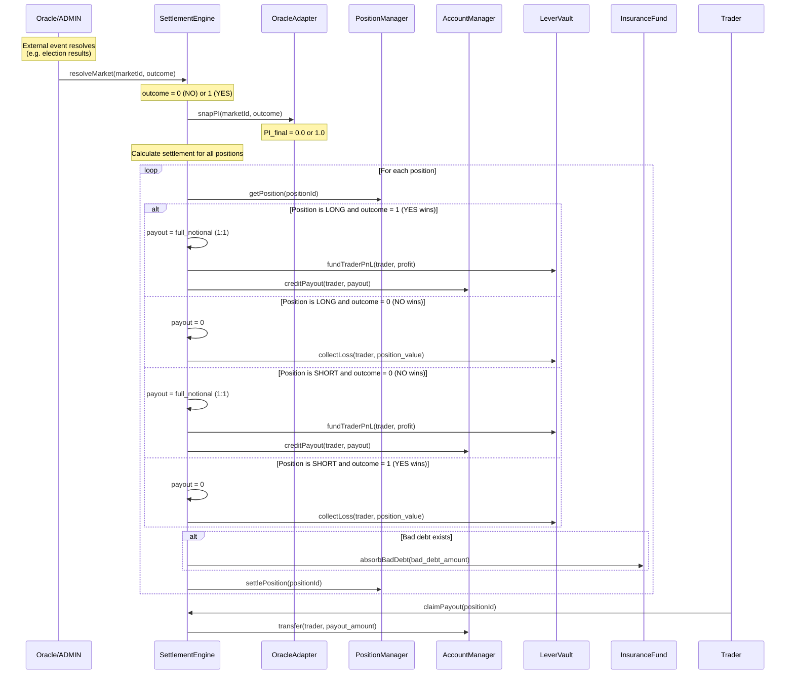

# LEVER Protocol — Technical Architecture

## Overview

LEVER is a synthetic leveraged perpetuals protocol for prediction markets. Traders take leveraged positions on binary outcomes (elections, sports, tech events) while a unified LP pool backs all trades. The protocol does NOT create its own price discovery — instead, it references external prediction market prices (Polymarket) as its oracle.

**Key Technical Characteristics:**
- **Chain:** Base Sepolia (testnet) → Base (mainnet)
- **Asset:** USDT (6 decimals) with internal WAD (1e18) math
- **Architecture:** 16 contracts + 3 libraries
- **Leverage:** Dynamic, up to 30× (decreases toward resolution)
- **Oracle:** External price feeds with sophisticated smoothing
- **LP Pool:** Unified ERC-4626 vault with tranche-based yield distribution

---

## System Architecture Overview



---

## Contract Dependency Graph

### Libraries (Foundation Layer)
```mermaid
graph LR
    FPM[FixedPointMath<br/>WAD math]
    RC[RiskCurves<br/>R(τ) calculations]
    PI[ProbabilityIndex<br/>PI validation]

    FPM --> RC
    FPM --> PI
```

### Core Dependencies


---

## Oracle Flow: Polymarket → On-Chain PI



---

## Trading Flow: Position Open → Close



---

## Liquidation Flow



---

## Fee Distribution Architecture



### Fee Tier System

The protocol operates two fee tiers based on Insurance Fund Ratio (IFR):

| Tier | Condition | LP Share | Protocol | Insurance |
|------|-----------|----------|----------|-----------|
| **Tier 1** | IFR < 20% of TVL | 50% | 30% | 20% |
| **Tier 2** | IFR ≥ 20% of TVL | 50% | 50% | 0% |

---

## Vault Mechanics: Tranche Ledger System

LEVER uses a sophisticated tranche-based system that allows LPs to track yield separately from principal:



### Key Tranche Properties

1. **Yield Identity Preservation:** Each tranche remembers when it was created and accumulates yield proportionally
2. **Transfer Splitting:** When shares are transferred, both principal and accrued yield split proportionally
3. **Maximum 10 Tranches:** Addresses can hold up to 10 tranches; 11th deposit triggers automatic consolidation
4. **AMM Compatibility:** Yield survives DeFi passage through proportional splitting

---

## Settlement Flow: Market Resolution



---

## Role & Permission Model

```mermaid
graph TB
    subgraph "Admin Roles"
        ADMIN[ADMIN_ROLE<br/>Contract owner]
        MARKET_MGR[MARKET_MANAGER<br/>Market lifecycle]
        ORACLE_ROLE[ORACLE_ROLE<br/>Price feeds & resolution]
        KEEPER[KEEPER_ROLE<br/>Parameter updates]
    end

    subgraph "Admin Permissions"
        ADMIN --> PAUSE[Pause/unpause contracts]
        ADMIN --> ROLES[Grant/revoke roles]
        ADMIN --> EMERGENCY[Emergency functions]
        ADMIN --> VOID[Void markets]
    end

    subgraph "Market Manager Permissions"
        MARKET_MGR --> CREATE[Create markets]
        MARKET_MGR --> ACTIVATE[Activate markets]
        MARKET_MGR --> LIVE[Set markets live]
        MARKET_MGR --> METADATA[Update market metadata]
    end

    subgraph "Oracle Permissions"
        ORACLE_ROLE --> PRICE[Push price updates]
        ORACLE_ROLE --> RESOLVE[Resolve markets]
        ORACLE_ROLE --> PENDING[Set pending resolution]
        ORACLE_ROLE --> FREEZE[Freeze/unfreeze markets]
    end

    subgraph "Keeper Permissions"
        KEEPER --> PARAMS[Update smoothing parameters]
        KEEPER --> LEVERAGE[Update leverage params]
        KEEPER --> ACCRUAL[Trigger fee accrual]
    end

    style ADMIN fill:#ffebee
    style MARKET_MGR fill:#e8f5e8
    style ORACLE_ROLE fill:#e3f2fd
    style KEEPER fill:#fff3e0
```



### Role Assignment by Contract

| Contract | ADMIN | MARKET_MANAGER | ORACLE | KEEPER |
|----------|-------|----------------|--------|---------|
| **MarketRegistry** | ✓ | Create/activate/live | Resolve/pending | — |
| **OracleAdapter** | ✓ | — | Push prices/freeze | Update params |
| **ExecutionEngine** | ✓ | — | — | — |
| **LeverageModel** | ✓ | — | — | Update params |
| **LeverVault** | ✓ | — | — | — |
| **LiquidationEngine** | ✓ | — | — | Liquidate (anyone) |
| **SettlementEngine** | ✓ | — | Resolve | — |

---

## Market Categories & Examples

LEVER supports diverse binary prediction markets across multiple categories:

| Category | Example Markets | Typical Duration |
|----------|-----------------|------------------|
| **Tech** | SpaceX IPO 2026?, OpenSea Token Launch? | 3-12 months |
| **Geopolitics** | US-Iran Ceasefire?, Taiwan Invasion? | 1-6 months |
| **Sports** | FIFA World Cup Winner: Spain? | Event-specific |
| **Macro** | Fed Rate Below 4%?, Inflation Above 3%? | Quarterly/Annual |
| **Stocks** | AAPL Above $250?, TSLA Below $100? | Monthly/Quarterly |
| **Crypto** | BTC Above $100k?, ETH Merge 2.0? | Event-specific |
| **Forex** | EUR/USD Above 1.10?, Argentina 1500 ARS/USD? | Monthly |
| **Speculative** | Nothing Ever Happens 2026? | Annual memes |

Each market includes:
- **Resolution Time:** Fixed timestamp for outcome determination
- **Category:** Used for allocation weights and risk adjustments
- **Polymarket Reference:** Link to external price source
- **Initial Probability:** Starting PI value for trading

---

## Risk Management Framework

```mermaid
graph TB
    subgraph "Time-to-Resolution (τ) Effects"
        TAU[τ hours remaining]
        TAU --> R_MECH[R(τ) = 1 - e^(-2τ/24)]
        TAU --> R_BORROW[R_borrow(τ) = 1 - e^(-2τ/168)]
    end

    subgraph "Market-Specific Adjustments"
        VOL[Volatility Factor]
        DEPTH[Depth Factor]
        CONC[Concentration Factor]

        VOL --> M_MARKET[M_market = min(vol×depth×conc)]
        DEPTH --> M_MARKET
        CONC --> M_MARKET
    end

    subgraph "Risk-Adjusted Parameters"
        R_MECH --> R_ADJ[R_adjusted = R(τ) × M_market]
        M_MARKET --> R_ADJ

        R_BORROW --> R_BORROW_ADJ[R_borrow_adjusted]
        M_MARKET --> R_BORROW_ADJ
    end

    subgraph "Dynamic Constraints"
        R_ADJ --> LEV_COMP[Leverage Compression]
        R_ADJ --> OI_MULT[OI Cap Multiplier]
        R_ADJ --> MM_MULT[Margin Multiplier]

        R_BORROW_ADJ --> BORROW_MULT[Borrow Rate Multiplier]
    end

    style TAU fill:#fff3e0
    style R_ADJ fill:#ffebee
    style LEV_COMP fill:#e8f5e8
```

### Key Risk Principles

1. **Leverage → 1× at Resolution:** Borrow fees and margin requirements force full collateralization
2. **Live Market Compression:** 70% reduction in effective time when markets go "live"
3. **Concentration Penalties:** Large positions in single markets face increased constraints
4. **Volatility Dampening:** High volatility markets get reduced parameters
5. **Depth Requirements:** Shallow external markets get reduced capacity

---

## Data Structures & Storage

### Position Struct
```solidity
struct Position {
    uint256 id;                // Unique position identifier
    address owner;             // Position owner
    bytes32 marketId;          // Market reference
    bool isLong;               // true = YES, false = NO
    uint256 entryPI;           // PI at position open (WAD)
    uint256 entryPrice;        // Execution price (WAD)
    uint256 positionSize;      // Notional amount (WAD)
    uint256 collateral;        // Net collateral (WAD)
    uint256 leverage;          // Effective leverage (WAD)
    uint256 borrowIndex;       // Borrow fee index snapshot
    int256 fundingIndex;       // Funding rate index snapshot
    uint256 openTimestamp;     // Block timestamp at open
    bool isOpen;               // Position status
}
```

### Market Struct
```solidity
struct Market {
    bytes32 id;                // Market identifier
    string name;               // Human readable name
    string category;           // Category for risk adjustments
    uint256 resolutionTime;    // Scheduled resolution timestamp
    uint256 allocationWeight;  // Weight for OI allocation (WAD)
    MarketState state;         // LISTED/ACTIVE/PENDING/RESOLVED/VOIDED
    uint256 outcome;           // Final outcome (0 or 1)
    bool isLive;               // Live event status
    uint256 liveStartTime;     // When market went live
}
```

### Tranche Struct
```solidity
struct Tranche {
    uint256 shares;            // Share balance in this tranche
    uint256 yieldDebt;         // Yield debt for reward calculation
    uint256 timestamp;         // Creation timestamp
    uint256 navSnapshot;       // NAV at creation
}
```

---

This architecture enables LEVER to provide synthetic leverage on any binary prediction market while maintaining strict risk controls and efficient capital utilization through the unified LP pool model.